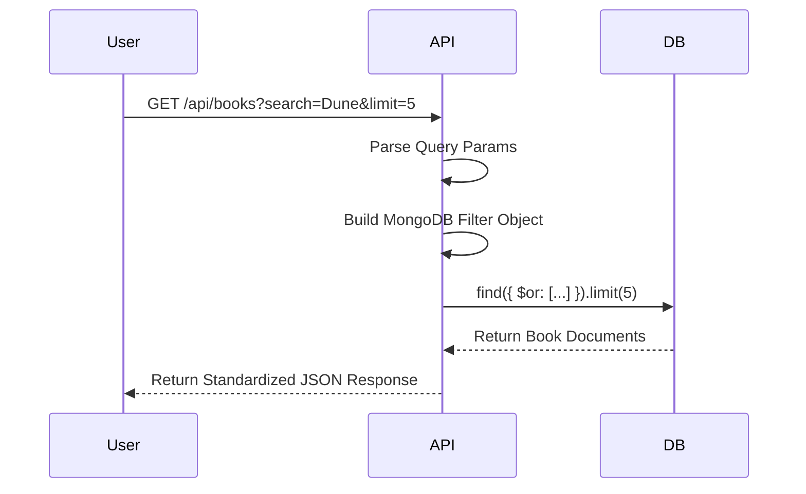
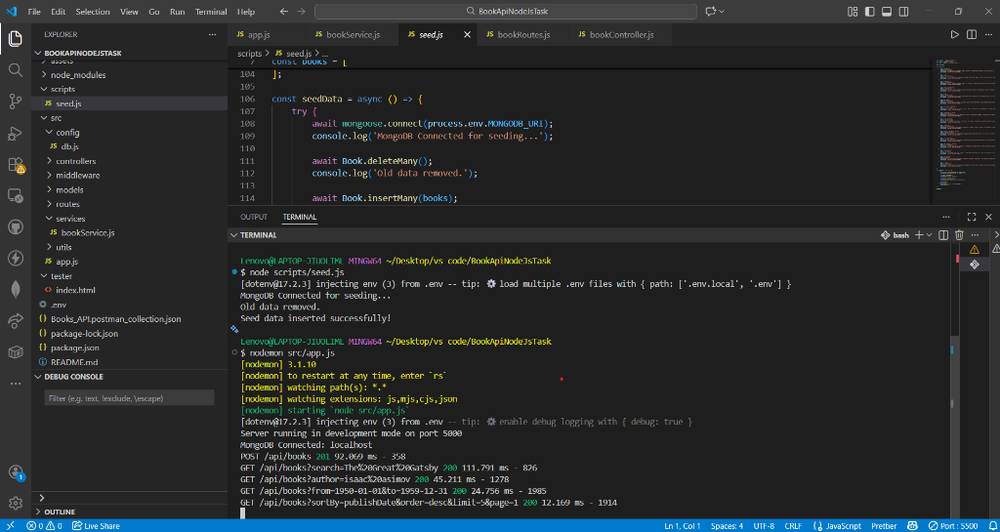
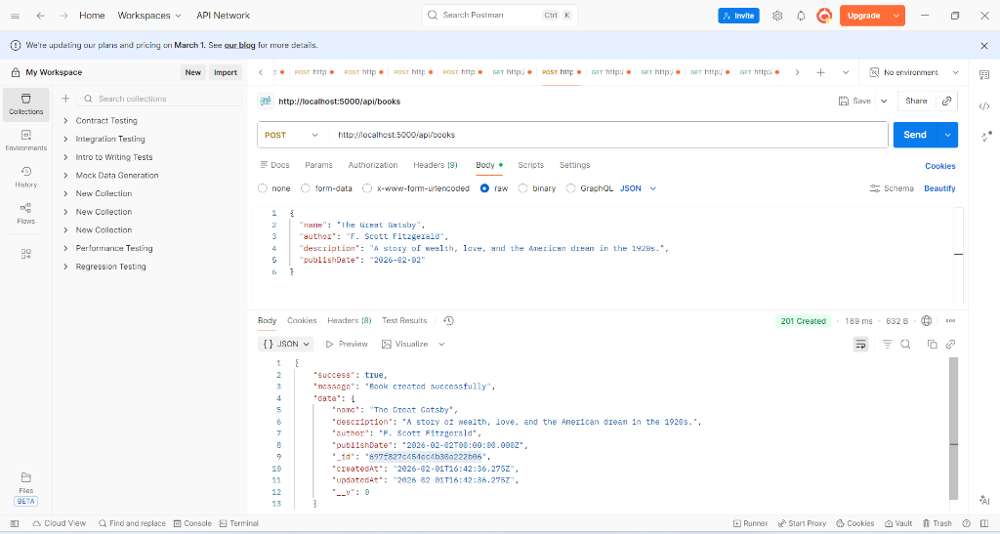
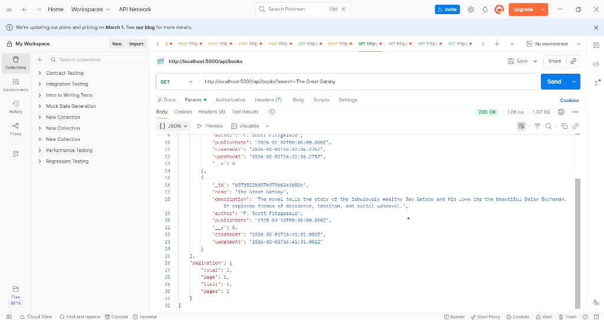
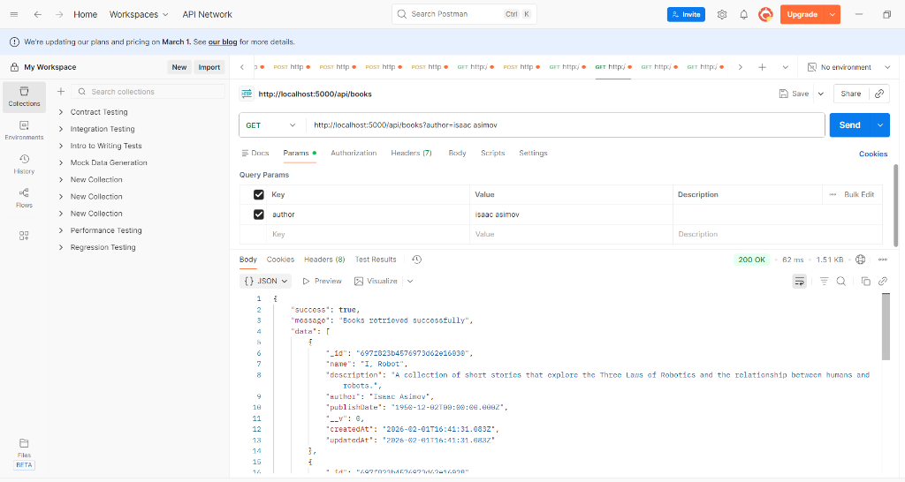
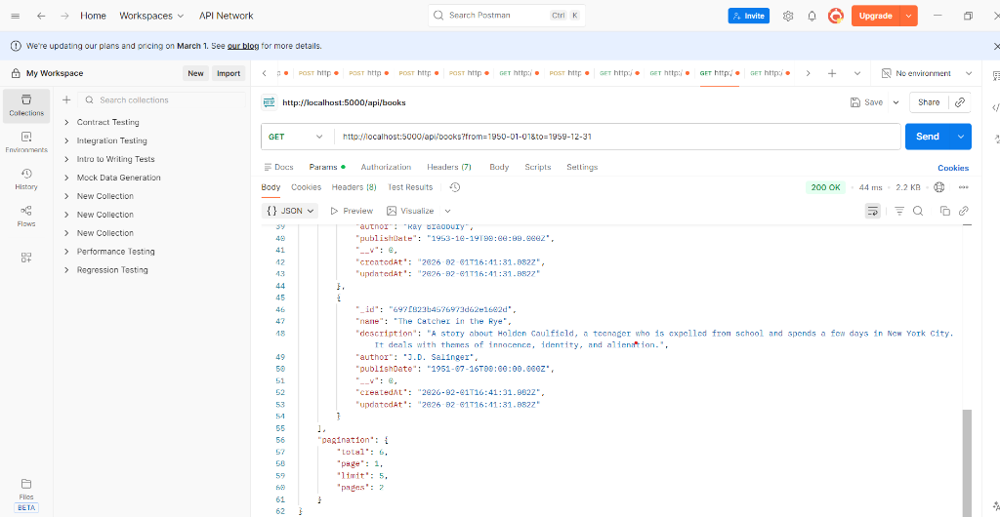
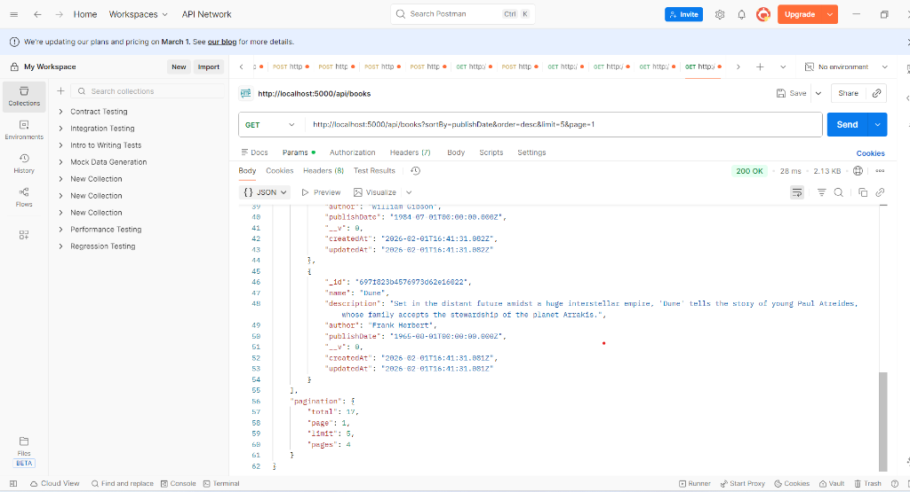

# 📚 Books API - Industrial Node.js Service

> A robust, production-ready REST API built with Node.js, Express, and MongoDB, featuring advanced search, filtering, and pagination.

## 🚀 Features

-   **CRUD Operations**: Full Create, Read functionality for Book resources.
-   **Advanced Search**: Full-text search capabilities over Book Names and Descriptions.
-   **Granular Filtering**: Precise filtering by Author (Case-Insensitive) and Date Ranges.
-   **Pagination & Sorting**: Optimized performance with cursor-based limits and dynamic sorting.
-   **Industrial Architecture**: Clean separation of concerns (MVC Pattern) with standardized Service Layer.
-   **Robust Validation**: Request payload validation using Joi.
-   **Centralized Error Handling**: Uniform error responses and status codes.

## 🛠️ Tech Stack

| Component | Technology | Description |
| :--- | :--- | :--- |
| **Runtime** | **Node.js** | Event-driven JavaScript runtime. |
| **Framework** | **Express.js** | Fast, unopinionated web framework. |
| **Database** | **MongoDB** | NoSQL database for flexible data modeling. |
| **ORM** | **Mongoose** | Elegant MongoDB object modeling. |
| **Validation** | **Joi** | Schema description language and data validator. |
| **Logging** | **Morgan** | HTTP request logger middleware. |

---

## ⚙️ Installation & Setup

1.  **Clone the Repository**
    ```bash
    git clone <repository_url>
    cd BookApiNodeJsTask
    ```

2.  **Install Dependencies**
    ```bash
    npm install
    ```

3.  **Configure Environment**
    Ensure `.env` file exists in the root:
    ```env
    PORT=5000
    MONGODB_URI=mongodb://localhost:27017/books_api
    NODE_ENV=development
    ```

4.  **Seed Database (Important)**
    Populate the DB with diverse testing data:
    ```bash
    npm run seed
    ```

5.  **Start Server**
    ```bash
    npm run dev
    ```

---

## 📡 API Reference

### Response Structure (Standardized)
Every API response follows this industrial standard format:

| Field | Type | Description |
| :--- | :--- | :--- |
| `success` | `Boolean` | Indicates request success (`true`/`false`). |
| `message` | `String` | Human-readable status message. |
| `data` | `Object/Array` | The requested payload (Books). |
| `pagination` | `Object` | (Optional) Metadata for lists (`page`, `limit`, `total`). |

### Query Parameters

| Parameter | Type | Description | Example |
| :--- | :--- | :--- | :--- |
| `search` | `string` | Full-text search (Name/Desc). | `?search=galaxy` |
| `author` | `string` | Filter by Author (Exact). | `?author=Frank Herbert` |
| `from` | `date` | Filter Start Date (ISO). | `?from=1950-01-01` |
| `to` | `date` | Filter End Date (ISO). | `?to=1960-12-31` |
| `sortBy` | `string` | Sort field name. | `?sortBy=publishDate` |
| `order` | `string` | Sort direction (`asc`/`desc`). | `?order=desc` |
| `limit` | `number` | Items per page (Max 50). | `?limit=10` |

---

## 🏗️ System Architecture

The project follows a layered architecture to ensure scalability and maintainability.

```mermaid
graph TD
    Client[Client (Postman/Browser)] -->|HTTP Request| Router[Express Router]
    Router -->|Dispatch| Controller[Controller Layer]
    Router -->|Dispatch| Controller[Controller Layer]
    Controller -->|Validate| Middleware[Validation Middleware]
    Controller -->|Call| Service[Service Layer]
    Service -->|Query| Model[Mongoose Model]
    Model -->|Read/Write| DB[(MongoDB Database)]
    DB -->|Result| Model
    Model -->|Data| Service
    Service -->|Business Logic| Controller
    Controller -->|JSON Response| Client
```

## 🔄 API Flow Diagram

Logic flow for the **Explore Books** endpoint:



---

## 📂 Project Structure

```bash
BookApiNodeJsTask/
├── scripts/
│   └── seed.js             # Database seeding script (15+ books)
├── src/
│   ├── config/             # DB Configuration
│   │   └── db.js
│   ├── controllers/        # Request Handlers
│   │   └── bookController.js
│   ├── middleware/         # Error Handling & Validation
│   │   ├── error.js
│   │   └── validator.js
│   ├── models/             # Mongoose Schemas
│   │   └── Book.js
│   ├── routes/             # API Route Definitions
│   │   └── bookRoutes.js
│   ├── services/           # Business Logic Layer
│   │   └── bookService.js
│   ├── utils/              # Helper Classes
│   │   ├── ApiResponse.js
│   │   └── ErrorResponse.js
│   └── app.js              # Application Entry Point
├── tester/
│   └── index.html          # Frontend Visual Tester
├── .env                    # Environment Variables
├── package.json            # Dependencies & Scripts
└── README.md               # Project Documentation
```

---

## 🧪 How to Test

### Why Testing Matters?
Rigorous testing ensures that the API behaves consistently under edge cases (e.g., missing fields, invalid dates). It verifies the "contract" between the Backend and any potential Frontend clients.

### Visual Verification
1.  Open `tester/index.html` in your browser.
2.  Use the interface to create books and search/filter in real-time.

---

## 📸 Testing Screenshots

### 1. Backend Terminal (Running & Database Connection)
> *Place your terminal screenshot here. It should show `npm run dev` output, "MongoDB Connected", and the server port.*
> 

### 2. Postman: Create Book (Success 201)
> *Testing the Create Endpoint*
> 

### 3. Postman: Search & Filter
> *Search Query & Results*
> 
> 

> *Complex Filter Query (Author + Sort)*
> 
> 

---

## 🔮 Future Scope

To further enhance this project for large-scale production use, the following improvements are planned:

1.  **Authentication & Authorization**: Implement **JWT (JSON Web Tokens)** to secure endpoints (e.g., only Admin can create books).
2.  **Unit & Integration Testing**: Add **Jest** and **Supertest** for automated test coverage beyond manual verification.
3.  **Containerization**: Add **Docker** and `docker-compose` support for consistent deployment environments.
4.  **API Documentation**: Integrate **Swagger/OpenAPI** for interactive, auto-generated API docs.
5.  **Rate Limiting**: Implement `express-rate-limit` to prevent abuse.
6.  **CI/CD Pipeline**: Set up GitHub Actions for automated testing and linting on push.
